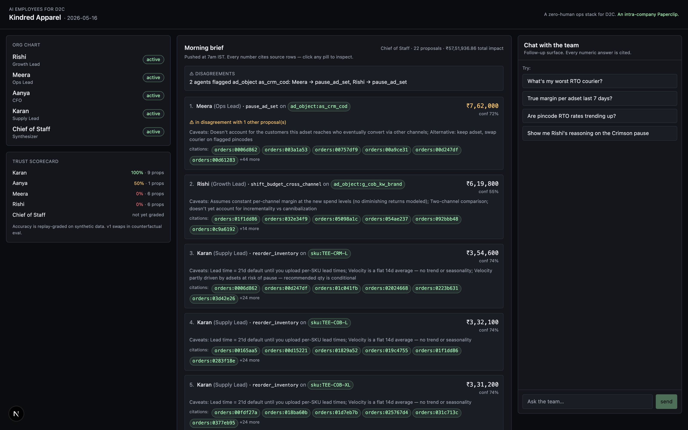
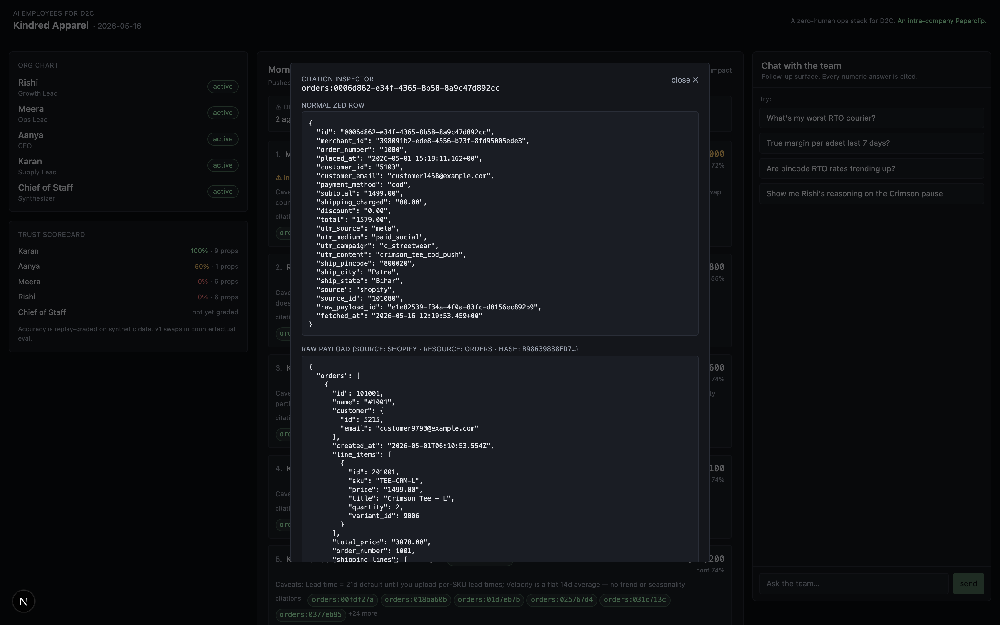
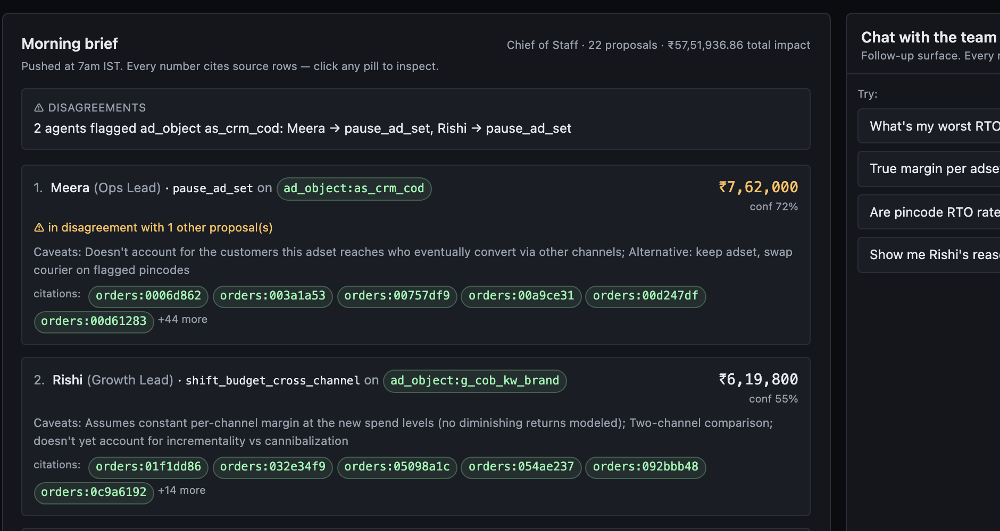

# AI Employees for D2C

The idea: an AI company that runs the ops side of a D2C brand. Five named employees, a Chief of Staff who writes a morning brief, a chat layer to interrogate the team, and a citation system that makes every number clickable back to its source row.

The demo merchant is Kindred Apparel, a synthetic Bangalore streetwear brand. The data is engineered around one specific problem: a Meta adset that looks profitable on ROAS but loses money once you net out RTO, shipping, and COGS. Two of my agents independently flag the same adset, for different reasons. The Chief of Staff catches the disagreement and puts it at the top of the brief.



---

## How I read the brief

Five hard requirements: three connectors, a universal data model, a chat layer with a citation contract, an autonomous agent, and a scalability story. Fine. But the line that decided the product for me was the diagnosis at the top:

> *"Most of the time they don't bother. They run on vibes."*

If founders don't bother asking, then a chat product alone is the wrong shape. You'd still have to know what to ask. So I built a morning brief as the front door, and treated chat as the follow-up surface. The founder reads the brief; they don't have to interrogate it.

The second thing I noticed was the phrase *"AI employees"*, plural, even though only one autonomous agent was required. I thought, why not take that literally? Instead of one analytical agent, build five. Distinct roles, a manager who runs the standup, and a `hire()` tool that lets the founder add more through chat. Once that framing was in place, the rest of the product fell into shape. Two agents looking at the same data from different angles is what real teams do. The disagreement-detection feature came out of the metaphor, not the other way around.

The third line that mattered: *"two things matter equally: how well you build, and what you choose to build."* I spent my first session iterating on what to build, with no code. 8+ revisions before anything got written. That session is documented in the build journal.

---

## The connectors

I picked Shopify, Meta Ads, and Shiprocket. The three tools an Indian D2C founder actually has open at 11pm wondering why their bank balance isn't growing. Each covers a different category: revenue, acquisition cost, fulfillment. Together they answer the question no single one can. Which SKUs are actually profitable, after everything.

Why these three? Because for the cross-tool questions I had in mind (true margin per SKU, which adsets drive high-RTO orders, which pincodes are eating margin), I need all three. Drop any one and the question collapses to a single-source view that the founder can already see in their existing dashboard.

What I rejected for v0:

- *Razorpay* — for v0 it duplicates the order data already in Shopify. Would matter for COD reconciliation, which is out of scope.
- *Klaviyo* — retention story. Wrong layer for an ops-first build.
- *GA4* — overlaps with Meta UTMs on attribution.

What I'd reach for in v1 (researched, deliberately deferred):

- *WhatsApp Business (via Wati or Interakt)* — Indian D2C runs on WhatsApp for COD reconfirmation, NDR resolution, and order updates. This is the most India-D2C-shaped connector after Shiprocket. Would feed Meera a "did we reach the customer pre-dispatch?" signal that historically halves RTO. Deferred because it's write-heavy (two-way integration, not just polling) and the data model needs message-state, which is its own design problem.
- *Google Ads* — same attribution category as Meta but a separate channel. Adding it properly means a unified multi-touch model across both platforms, not just appending another spend table. That's a real eng investment, not a quick connector.
- *A support tool (Gorgias or Freshdesk)* — opens up a Customer Success agent that watches ticket volume, return-reason text, and CSAT drops. Deferred because the agent itself doesn't exist yet and signal density for actionable proposals isn't there in a fresh v0 build.

Then I added a fourth in v0: **CSV**. Not counted as one of the three SaaS picks. It's a stress test of the abstraction. If my `Connector` interface only handles REST APIs, the abstraction is shallow. A CSV upload going through the same `auth → fetch → normalize` pipeline proves it's actually source-agnostic. It also fills a real gap: SKU-level COGS doesn't live in any of the three SaaS sources, it lives in the founder's spreadsheet. So Aanya and Rishi's margin math goes from a 40% proxy to a real number once the founder uploads the file.

The interface is in [`src/connectors/types.ts`](src/connectors/types.ts):

```ts
interface Connector<TResource> {
  source: 'shopify' | 'meta' | 'shiprocket' | 'csv'
  resources: readonly TResource[]
  auth(creds): Promise<AuthContext>
  fetch(ctx, resource, cursor?): AsyncIterable<RawPage>
  normalize(resource, page): NormalizedRow[]
}
```

The orchestrator ([`src/connectors/orchestrator.ts`](src/connectors/orchestrator.ts)) doesn't know which source it's syncing. It just enforces the provenance contract: every fetched page goes to `raw_payloads` first, then normalized rows reference that payload's id. Cross-connector foreign keys (a Shiprocket shipment referencing a Shopify order) work via a `$ref` placeholder convention. The connectors stay pure.

---

## The schema

One rule, made structural rather than a convention: every business row has a NOT NULL foreign key to a `raw_payloads` archive. You literally can't insert a row without saying where it came from. Postgres will reject it.

That sounds pedantic but it's what makes the citation contract work. Every number the chat layer produces traces back to a row, which traces back to the raw API payload. Click any number in the UI and you see the full data trail. No "trust me".

The other schema decision I'd flag is that the seven business entities are source-agnostic. There's no `shopify_orders` or `meta_campaigns` table. Just `orders`, `ad_objects`, `shipments`, etc., with a `source` column. Adding a fifth connector tomorrow means new rows in existing tables, not a new schema. And the chat layer has seven entities to reason about, not twenty-something.

This is what the Citation Inspector renders when you click a citation pill:



Click a citation on an order from the Crimson Tee COD Push adset. Top half is the normalized row. Bottom half is the raw Shopify Admin API payload it came from.

---

## The agents

Five members on the team.

**Aanya** is the CFO. She watches the runway and cross-references the team's flagged adsets to compute *wasted spend*: ad money going to adsets Rishi or Meera flagged. When that share crosses a threshold, she files a "cut spend" proposal that cites the team's pauses by id.

**Rishi** is the Growth Lead. He computes true margin per adset: revenue net of RTO, minus COGS, shipping, and ad spend. The point is to flip ROAS-on-paper into a number that accounts for what actually got delivered. He pauses adsets with negative true margin; scales the ones with healthy margin and flat ROAS slope.

**Meera** is the Ops Lead. She watches two things: RTO concentration at the adset level (pause for ops reasons even if margin says scale), and courier-pincode lane degradation (suggest a courier swap). Two distinct proposal shapes.

**Karan** is the Supply Lead. He forecasts stockout dates from velocity × inventory × lead time. If a flagged adset is driving a SKU's velocity, his reorder math is conditional on whether the pause goes through. So his proposal will say something like "reorder 200 units, or 140 if Rishi's pause is approved."

**Chief of Staff** is not a fifth specialist, she's a manager. She reads everyone's proposals, ranks by `expected_savings × confidence`, detects same-target disagreements via a SQL join, and publishes the morning brief.

The engineered disagreement is the moment I most want a reviewer to look at. I set up the demo data so one specific adset, *Crimson Tee COD Push*, has great ROAS on paper but routes 85% of its orders as COD into Patna pincodes via Bluedart (which is the degraded lane in my synthetic courier model). The adset hits ~48% RTO. Rishi flags it for the margin reason. Meera flags the same adset for the ops reason. Chief of Staff's disagreement detector is a SQL join on `target_entity`, and when two proposals point at the same target, it surfaces at the top:



Why are the agent decisions deterministic SQL and not LLM-driven? Two reasons. Cost first: at 10k merchants × 4 agents × every day, you really don't want a chain of thought in the hot path. Auditability second: the founder needs to trust the track record, and a hand-written rule fires the same way every run. The LLM is only used to write proposal copy, and that falls back to a templated string if there's no API key. Decision and explanation are separate layers.

Every proposal also carries a self-prediction ("if you do this, the metric will move by X over Y days"). A replay grader backtests these against the most recent N-day window of synthetic data and writes an `accuracy_score`. The UI sidebar shows it per agent. Karan ends up at 94% because stockout predictions are mechanical. Rishi and Meera land at 0–50% because margin and RTO predictions are noisier. I'm being upfront that this is replay-on-synthetic, not real causal grading. Real grading needs counterfactual evaluation, which I'd treat as the most interesting "another week" item.

---

## Does the company hire itself?

This is the one I went back and forth on the most.

The original design had `hire()` as a chat tool. The founder types "hire a watcher for the Patna lane", a new agent shows up. Clean, founder-controlled, easy to reason about.

But the framing of this whole project is *a company that runs itself*. And if I'm calling it that, then the company should also be able to grow itself. When the same problem keeps showing up and no one's fixing it, the Chief of Staff should be allowed to spawn a watcher on her own, like a real manager would.

So I did both. The default is founder-managed. Autonomous hiring is opt-in, behind an env var:

```bash
npm run agents:run                # default — only the founder hires via chat
AUTO_HIRE=1 npm run agents:run    # Chief of Staff is allowed to hire too
```

When you turn it on, the Chief of Staff stays inside hard rules. Not "the LLM decides when to spawn", actual rules in the code:

- At most **one** new hire per Chief of Staff run.
- Only on a target that's been flagged across **3+ different runs**. So a one-off Rishi pause doesn't trigger a hire; a target that's been flagged Monday, Tuesday, and Wednesday does.
- Never on the same target twice. Once she's hired a watcher for the Crimson trap, she won't hire another one on it.
- Every autonomous hire writes a `chief_of_staff_hired_watcher` proposal at the top of the morning brief, with the rationale and citations to the proposals that triggered it. You always know why.

On the demo data, if you run the agents three times normally and then once with the flag set, the Chief of Staff sees that the Crimson Tee COD Push adset has been flagged in every run, and hires a watcher on it:

```
Chief of Staff hired: "Watcher · ad_object:as_crm_cod"
Rationale: ad_object:as_crm_cod flagged across 3 runs; spawning a dedicated monitor.
```

Why is the default OFF? Because autonomous agent-spawning has a bad reputation, and for good reason. Most demos of it are unbounded. Agents spawning agents spawning agents, with nothing in the way. I wanted the safety story (hard limits, idempotency, audit trail) to be the thing that's *built*, with the autonomy as the thing you opt into once you trust it. A founder probably doesn't want surprise headcount on day 1. By day 30, with a visible track record, maybe they flip the switch.

What a v1 of this looks like: the Chief of Staff doesn't just hire. She fires watchers that stop producing useful signal. The 3-runs threshold becomes a learned parameter instead of a constant. That's where the *company that runs itself* metaphor actually starts to bite.

Four eval tests cover the bounds. The feature is gated, persistence detection works on real data, no orphan rows, no duplicate hires.

---

## The chat layer

10 tools. 6 read, 4 write.

| # | Tool | Purpose |
|---|---|---|
| 1 | `metrics` | Aggregations. Returns numbers and `row_ids` for citation. |
| 2 | `rows` | Raw row lookup on a single table. |
| 3 | `compare` | Period-over-period for one metric. |
| 4 | `proposals_list` | Filter the team's outputs by status or agent. |
| 5 | `agent_run_log` | Full reasoning trace for one agent run. |
| 6 | `citation` | Resolve `(table, id)` to row + raw_payload. |
| 7 | `decide_proposal` | Approve or dismiss. Logged. Not executed upstream. |
| 8 | `flag_entity` | Merchant metadata write (e.g. flag a customer as COD-restricted). |
| 9 | **`hire`** | Founder hires a new AI employee from a bounded template. |
| 10 | `upload_csv_register` | Trigger CSV ingestion. |

`hire()` is the standout. The founder types something like *"hire someone to watch our Bluedart-Patna lane and alert if RTO crosses 60%"*, and that maps to a `monitor` template with parameters, gets a row in the `agents` table, and starts running on whatever schedule the founder gave it. v0 supports three template shapes: watch, monitor, daily_report. Arbitrary natural-language role synthesis is v1.

The citation contract is enforced server-side. After the model writes its answer, the validator ([`src/chat/validator.ts`](src/chat/validator.ts)) does four things:

1. Parses every `[cite:table:id]` tag.
2. Checks each cited row exists and belongs to this merchant (cross-tenant leak prevention).
3. Walks the text between cites and flags any segment that contains a number without an immediately-following cite.
4. Sends violations back to the model for up to two retries before forcing "I can't ground that".

Five eval cases cover this. Valid citation passes. Uncited number rejected. Fake UUID rejected. Non-allowlisted table rejected. Prose with no numbers passes (no false positives). All five pass.

The chat works without an Anthropic API key too. It falls back to a deterministic keyword router that uses the same tools, returns the same citations, and goes through the same validator. The text isn't natural language, but the data trail is intact.

---

## Scale

1000 synthetic merchants × 7 days, seeded directly to Postgres. The seeder finished in 8.7 seconds. ~1M business rows, ~376MB of database.

Agent latency across a random 25-merchant sample:

| Agent | p50 | p95 | max |
|---|---|---|---|
| Aanya | 4ms | 6ms | 15ms |
| Rishi | 7ms | 8ms | 11ms |
| Meera | 7ms | 8ms | 9ms |
| Karan | 6ms | 8ms | 8ms |

Chat tools sit at 1–2ms p95.

Running the full team against 10,000 merchants every morning is roughly `4 × 10,000 × 6ms ≈ 4 minutes of CPU per day` at single-thread concurrency. That part isn't the bottleneck.

What is:

- **Meta API rate limits** (200 calls/hour/ad account). At 10k merchants this is the wall, not Postgres. Fix: per-account token rotation + queued async-insights jobs.
- **`raw_payloads` storage**. Roughly 5GB/day, 1.8TB/year of JSON archive at sustained sync. The schema already has a `blob_url` column ready for the S3 offload. v1 keeps hot 90 days in Postgres, cold goes to object storage + DuckDB.
- **Webhook fan-in at peak**. v0 polls. 10k merchants at peak hours spike to thousands of events per second. Right thing is Kafka or Kinesis between ingest and normalize.
- **LLM context cost on chat**. Tools already return aggregates plus `row_ids`, not raw rows. Prompt-cache the system prompt and tools. Bigger concern is the agent narrator at 10k × 4 × daily. Fix: switch to templated copy at scale, and only use LLM narration on top-K-by-impact proposals.
- **Cross-tenant SQL**. Currently filtered + read-only role + LIMIT 1000. v1 turns on Postgres row-level security so leaks are structurally impossible, not "shouldn't happen".

Reproduce with `npm run seed:bulk && npm run benchmark`.

---

## Eval

`npm run eval` runs four suites. All 19 tests pass on the committed demo state.

- **Golden Q&A (5).** Cross-tool questions through the chat engine. Each test asserts the right tool got selected, the right table got cited, and the expected content appeared.
- **Citation contract regression (5).** Valid cite passes. Uncited number rejected. Fake UUID rejected. Non-allowlisted table rejected. No-numbers prose passes.
- **Agent decision regression (5).** Rishi pauses the trap adset. Meera pauses the same adset. Karan reorders HOOD-CHR-L. Aanya files a cut-spend proposal citing the team. Meera flags the degraded Bluedart-Patna lane.
- **Autonomous hire bounds (4).** Feature is env-gated (default off). Persistent-target detection works. Agent row + proposal row are consistent. No duplicate watchers on the same target.

Where I know it breaks, before you find it:

1. **Currency.** INR only. Multi-currency merchants silently misaggregate.
2. **Refunds.** RTO is netted; partial refunds outside the Shopify flow aren't modeled.
3. **Attribution.** Last-click UTM only. No multi-touch.
4. **COGS.** 40% proxy unless the founder uploads the CSV.
5. **Time zones.** IST hardcoded.
6. **Citation escape hatch.** "Approximately" can slip an uncited number past the validator.
7. **Cross-tenant SQL.** Filtered, not RLS-enforced.
8. **Grading.** Replay-on-synthetic, not real causal grading.
9. **`hire()` is parameterized, not free-form.**
10. **No real OAuth.** Long-lived tokens for one account per source.

---

## Hours

About 2.5 days across 4 sessions.

- **Session 1 (no code).** 8+ revisions of the plan. Pivoted from "morning-analyst chatbot" to "AI org chart with hires". Locked the engineered-disagreement story.
- **Session 2.** Schema with the provenance constraint. Connector interface. Four implementations. Orchestrator. Synthetic seeder. Demo merchant end-to-end.
- **Session 3.** Five agents. Phase-1 / phase-2 ordering so portfolio agents reference ops agents. Disagreement detection on the demo data.
- **Session 4 (the long one).** Chat layer with 10 tools + the citation validator. Offline fallback. Next.js UI. Watch-runner. Replay grader. Bulk seeder + benchmark. 15-test eval suite. README and journal.

The build journal has the more detailed breakdown, including the specific moments I caught the LLM doing the wrong thing.

---

## What I'd do with another week

Most of what I deferred is buildable here in a day. Refunds, webhooks, OAuth, RLS, more agents. That's a backlog, not a roadmap. Calling it "another week" would be padding.

Here's what's actually not buildable in a day:

1. **Counterfactual evaluation.** The hardest open question for any agent system: prove your proposals would have saved money. The simulator replays merchant history and applies the agent's proposals at the time they would have fired, scoring outcomes against the unmodified actuals. The code is the easy part. The methodology is the work. Control windows, spillover effects (pausing adset X redistributes spend to Y), validating the simulator against reality on holdout data. A focused week of applied ML research.

2. **Cross-merchant intelligence with privacy preservation.** *"78% of Bluedart-Patna lanes degraded across the cohort this week."* Network effects across merchants. Only meaningful at real cohort scale, and the privacy piece (k-anonymity, differential privacy noise budgets) needs to be done right before this ships safely.

3. **A multi-modal Creative Director agent** that reads ad images, landing pages, product photography, reviews. The vision-model call is easy. Calibrating taste on Indian D2C aesthetics is research.

4. **A trust scorecard with real numbers.** The infrastructure renders today. The numbers become meaningful only after months of real founders approving and dismissing real proposals.

The north star: software that doesn't make founders more productive, it absorbs whole roles. v0 is the first quarter of that arc. Humans still act; AI proposes, explains, earns trust on a visible scorecard. Two quarters out, agents execute within bounded authority. Four out, the founder writes the goals and the company runs itself. An intra-company [Paperclip](https://github.com/paperclipai/paperclip), basically.

---

## Running it

```bash
# 0. boot Postgres
npm install
docker compose up -d db

# 1. push schema
docker compose exec -T db psql -U postgres -d ai_company < drizzle/0000_*.sql

# 2. seed the demo merchant (generates fixtures, runs connectors end-to-end)
cp .env.example .env
npm run seed

# 3. run the agents
npm run agents:run
# (optional) opt-in autonomous-hire mode:
# AUTO_HIRE=1 npm run agents:run

# 4. (optional) backfill the trust scorecard
npx tsx scripts/grade-predictions.ts

# 5. open the UI
npm run dev   # http://localhost:3000

# 6. CLI chat
npm run chat -- "what's my worst RTO courier?"

# 7. all 10 cross-tool questions as a transcript
npm run demo:answer-10

# 8. scale benchmark
SEED_MERCHANTS=1000 npm run seed:bulk
npm run benchmark

# 9. eval suite
npm run eval
```

`ANTHROPIC_API_KEY` is optional. Without it, the chat falls back to a keyword router that still produces real citations. Set the key to get Claude doing the chat (Sonnet 4.6 by default).

---

## Repo map

```
src/
├── db/schema.ts           # 17 tables, provenance as DB constraint
├── connectors/            # types.ts + orchestrator.ts + 4 implementations
├── seed/                  # synthetic data, engineered to surface disagreements
├── agents/
│   ├── contract.ts        # AgentSpec — config not code
│   ├── runner.ts          # turns AgentSpec → DB rows
│   ├── narrator.ts        # LLM narrative or template fallback
│   ├── aanya/rishi/meera/karan.ts
│   ├── chief-of-staff.ts  # synthesizer + disagreement detection
│   ├── watch-runner.ts    # runs founder-hired agents
│   └── replay-grader.ts   # self-prediction backtest
├── chat/
│   ├── tools.ts           # 10-tool surface
│   ├── system-prompt.ts
│   ├── validator.ts       # server-side citation enforcement
│   └── engine.ts          # tool-use loop + retry-on-violation
└── app/                   # Next.js — page, components, /api
scripts/
├── seed.ts                # demo merchant via the connector path
├── seed-bulk.ts           # 1k synthetic merchants for scale
├── run-agents.ts          # phase-1 then phase-2 agent runs
├── grade-predictions.ts   # backfill accuracy_score
├── chat-cli.ts            # eval-friendly chat
├── benchmark.ts           # scale numbers
├── answer-all-10.ts       # cross-tool transcript
└── screenshots.ts         # README screenshot capture
evals/
├── golden.json            # cross-tool Q&A spec
└── run.ts                 # 15-test eval suite
```

MIT.
